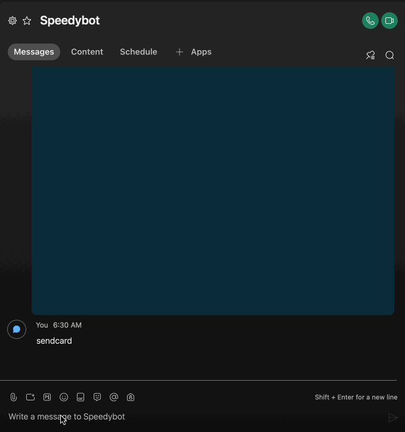
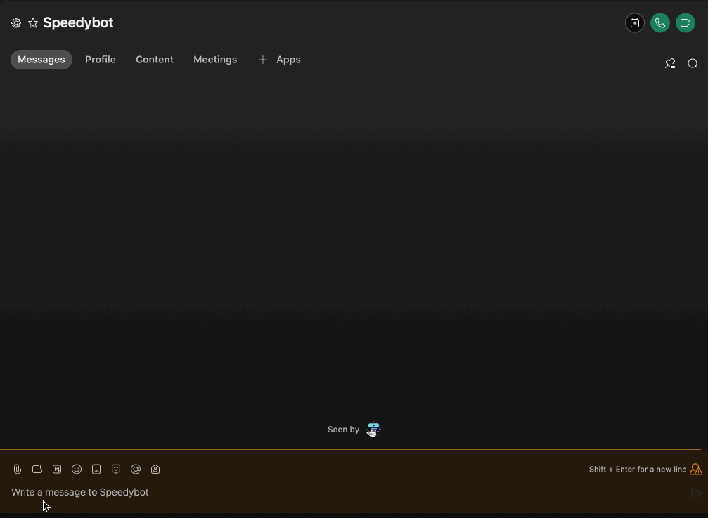

[speedybot-mini](../README.md) / [Exports](../modules.md) / BotInst

# Class: BotInst

Root bot object used in handlers-- enshrined with many convenience helpers & lessons learned the hard way


## Table of contents

### Constructors

- [constructor](BotInst.md#constructor)

### Properties

- [API](BotInst.md#api)
- [config](BotInst.md#config)
- [fallbackText](BotInst.md#fallbacktext)
- [locales](BotInst.md#locales)
- [meta](BotInst.md#meta)
- [roomId](BotInst.md#roomid)
- [token](BotInst.md#token)

### Methods

- [api](BotInst.md#api-1)
- [buildImLink](BotInst.md#buildimlink)
- [buildLink](BotInst.md#buildlink)
- [buildMeetingLink](BotInst.md#buildmeetinglink)
- [buildSpaceLink](BotInst.md#buildspacelink)
- [card](BotInst.md#card)
- [clearScreen](BotInst.md#clearscreen)
- [dangerCard](BotInst.md#dangercard)
- [debugCard](BotInst.md#debugcard)
- [deleteMessage](BotInst.md#deletemessage)
- [dm](BotInst.md#dm)
- [fillTemplate](BotInst.md#filltemplate)
- [generateFileName](BotInst.md#generatefilename)
- [getFile](BotInst.md#getfile)
- [getSelf](BotInst.md#getself)
- [guessContentType](BotInst.md#guesscontenttype)
- [handleExtension](BotInst.md#handleextension)
- [log](BotInst.md#log)
- [lookUp](BotInst.md#lookup)
- [peekFile](BotInst.md#peekfile)
- [pickRandom](BotInst.md#pickrandom)
- [rando](BotInst.md#rando)
- [say](BotInst.md#say)
- [send](BotInst.md#send)
- [sendCard](BotInst.md#sendcard)
- [sendDataAsFile](BotInst.md#senddataasfile)
- [sendDataFromUrl](BotInst.md#senddatafromurl)
- [sendJSON](BotInst.md#sendjson)
- [sendRandom](BotInst.md#sendrandom)
- [sendSnippet](BotInst.md#sendsnippet)
- [sendTemplate](BotInst.md#sendtemplate)
- [sendURL](BotInst.md#sendurl)
- [skyCard](BotInst.md#skycard)
- [snippet](BotInst.md#snippet)
- [stashCard](BotInst.md#stashcard)
- [successCard](BotInst.md#successcard)
- [thread](BotInst.md#thread)
- [translate](BotInst.md#translate)
- [warningCard](BotInst.md#warningcard)

## Constructors

### constructor

• **new BotInst**(`config`, `makeRequest?`)

#### Parameters

| Name | Type | Default value |
| :------ | :------ | :------ |
| `config` | `BotConfig`<`any`\> | `undefined` |
| `makeRequest` | `CoreMakerequest`<`any`\> | `RequesterFunc` |

#### Defined in

[lib/bot.ts:54](https://github.com/valgaze/speedybot-mini/blob/35574c0/src/lib/bot.ts#L54)

## Properties

### API

• `Private` **API**: `Object` = `API`

#### Type declaration

| Name | Type |
| :------ | :------ |
| `createWebhook` | `string` |
| `deleteMessage` | `string` |
| `deleteWebhook` | `string` |
| `getAttachmentDetails` | `string` |
| `getMembershipDetails` | `string` |
| `getMessage_Details` | `string` |
| `getPersonDetails` | `string` |
| `getSelf` | `string` |
| `getWebhooks` | `string` |
| `sendMessage` | `string` |

#### Defined in

[lib/bot.ts:52](https://github.com/valgaze/speedybot-mini/blob/35574c0/src/lib/bot.ts#L52)

___

### config

• **config**: `BotConfig`<`any`\>

___

### fallbackText

• `Private` **fallbackText**: `string` = `"Sorry, it appears your client does not support rendering Adaptive Cards, see here for more info: https://developer.webex.com/docs/api/guides/cards"`

#### Defined in

[lib/bot.ts:41](https://github.com/valgaze/speedybot-mini/blob/35574c0/src/lib/bot.ts#L41)

___

### locales

• **locales**: `Object` = `{}`

 Locales holder, passed in by Speedybot but hacky escape hatch available too

#### Defined in

[lib/bot.ts:51](https://github.com/valgaze/speedybot-mini/blob/35574c0/src/lib/bot.ts#L51)

___

### meta

• **meta**: `Object`

#### Type declaration

| Name | Type |
| :------ | :------ |
| `url` | `string` |

#### Defined in

[lib/bot.ts:44](https://github.com/valgaze/speedybot-mini/blob/35574c0/src/lib/bot.ts#L44)

___

### roomId

• **roomId**: `string` = `""`

#### Defined in

[lib/bot.ts:40](https://github.com/valgaze/speedybot-mini/blob/35574c0/src/lib/bot.ts#L40)

___

### token

• `Private` **token**: `string` = `""`

#### Defined in

[lib/bot.ts:43](https://github.com/valgaze/speedybot-mini/blob/35574c0/src/lib/bot.ts#L43)

## Methods

### api

▸ **api**<`T`\>(`request`, `requestInitr?`): `Promise`<`T`\>

Reach an api that returns JSON-- alias to fetch

```ts
import { Speedybot } from 'speedybot-mini'
// 1) Initialize your bot w/ config
const CultureBot = new Speedybot('tokenPlaceholder');

// 2) Export your bot
export default CultureBot;

// 3) Do whatever you want!

CultureBot.contains(["hi", "hey"],
 async ($bot, msg) => {
   const adviceResponse = await $bot.api('https://api.adviceslip.com/advice')
   const adviceText = $bot.lookUp(adviceResponse, 'slip.advice')
   $bot.send(`Here' some advice: ${adviceText}`)
})
```

#### Type parameters

| Name | Type |
| :------ | :------ |
| `T` | `any` |

#### Parameters

| Name | Type |
| :------ | :------ |
| `request` | `string` \| `Request` |
| `requestInitr?` | `RequestInit` \| `Request` |

#### Returns

`Promise`<`T`\>

#### Defined in

[lib/bot.ts:212](https://github.com/valgaze/speedybot-mini/blob/35574c0/src/lib/bot.ts#L212)

___

### buildImLink

▸ **buildImLink**(`target`, `label?`, `noBold?`): `string`

Build a markdown, click'able link to a specific person (1-1 space)

#### Parameters

| Name | Type | Default value | Description |
| :------ | :------ | :------ | :------ |
| `target` | `string` | `undefined` | (email) |
| `label?` | `string` | `undefined` |  |
| `noBold` | `boolean` | `false` |  |

#### Returns

`string`

#### Defined in

[lib/bot.ts:1426](https://github.com/valgaze/speedybot-mini/blob/35574c0/src/lib/bot.ts#L1426)

___

### buildLink

▸ **buildLink**(`target`, `label?`, `noBold?`): `string`

Generate a markdown link to a resource

#### Parameters

| Name | Type | Default value |
| :------ | :------ | :------ |
| `target` | `string` | `undefined` |
| `label?` | `string` | `undefined` |
| `noBold` | `boolean` | `false` |

#### Returns

`string`

markdown click'able link

#### Defined in

[lib/bot.ts:1393](https://github.com/valgaze/speedybot-mini/blob/35574c0/src/lib/bot.ts#L1393)

___

### buildMeetingLink

▸ **buildMeetingLink**(`target`, `label?`, `noBold?`): `string`

Build a markdown, click'able link to a meeting with a specific person)

#### Parameters

| Name | Type | Default value | Description |
| :------ | :------ | :------ | :------ |
| `target` | `string` | `undefined` | (email address) |
| `label?` | `string` | `undefined` |  |
| `noBold` | `boolean` | `false` |  |

#### Returns

`string`

#### Defined in

[lib/bot.ts:1410](https://github.com/valgaze/speedybot-mini/blob/35574c0/src/lib/bot.ts#L1410)

___

### buildSpaceLink

▸ **buildSpaceLink**(`target`, `label?`, `noBold?`): `string`

Build a markdown, click'able link to a specific space (OPT+CMD+K on Mac or CTRL-SHFT-K on windows to get space id)

#### Parameters

| Name | Type | Default value | Description |
| :------ | :------ | :------ | :------ |
| `target` | `string` | `undefined` | (email) |
| `label?` | `string` | `undefined` |  |
| `noBold` | `boolean` | `false` |  |

#### Returns

`string`

#### Defined in

[lib/bot.ts:1440](https://github.com/valgaze/speedybot-mini/blob/35574c0/src/lib/bot.ts#L1440)

___

### card

▸ **card**(`config?`): [`SpeedyCard`](SpeedyCard.md)

Convenience helper that creates a SpeedyCard



```ts
import { Speedybot } from 'speedybot-mini'
// 1) Initialize your bot w/ config
const CultureBot = new Speedybot('tokenPlaceholder');

// 2) Export your bot
export default CultureBot;

// 3) Do whatever you want!

CultureBot.contains(["hi", "hey"],
 async ($bot, msg) => {
  const cardData = $bot.card({
    title: "Speedybot Hub",
    subTitle: "Sign the paperwork",
    chips: ["ping", "pong", "hi", "files"],
    image: "https://i.imgur.com/LybLW7J.gif",
    url: "https://github.com/valgaze/speedybot-hub"
  });
  $bot.send(cardData);
 })

```

#### Parameters

| Name | Type |
| :------ | :------ |
| `config` | `Partial`<`AbbreviatedSpeedyCard` & { `label`: `string`  }\> |

#### Returns

[`SpeedyCard`](SpeedyCard.md)

#### Defined in

[lib/bot.ts:428](https://github.com/valgaze/speedybot-mini/blob/35574c0/src/lib/bot.ts#L428)

___

### clearScreen

▸ **clearScreen**(`repeatCount?`): `Promise`<`void`\>

Clear the screen on desktop clients (useful for demos)

```ts
```ts
import { Speedybot } from 'speedybot-mini'
// 1) Initialize your bot w/ config
const CultureBot = new Speedybot('tokenPlaceholder');

// 2) Export your bot
export default CultureBot;

// 3) Do whatever you want!

CultureBot.contains(["hi", "hey"],
 async ($bot, msg) => {
  $bot.send('This will more or less disappear...')
  $bot.clearScreen()
 })
```

#### Parameters

| Name | Type | Default value |
| :------ | :------ | :------ |
| `repeatCount` | `number` | `50` |

#### Returns

`Promise`<`void`\>

#### Defined in

[lib/bot.ts:1079](https://github.com/valgaze/speedybot-mini/blob/35574c0/src/lib/bot.ts#L1079)

___

### dangerCard

▸ **dangerCard**(`payload?`): [`SpeedyCard`](SpeedyCard.md)

Returns an instance of a dangerCard. dangerCards have blue skylike background:



```ts
import { Speedybot } from 'speedybot-mini'
// 1) Initialize your bot w/ config
const CultureBot = new Speedybot('tokenPlaceholder');

// 2) Export your bot
export default CultureBot;

// 3) Do whatever you want!

CultureBot.contains(["hi", "hey"],
 async ($bot, msg) => {
   const danger = $bot.dangerCard({
    title: '⛔️DANGER-- do not do that!⛔️',
    subTitle: 'There is a very important reason not to do that',
    chips: ['ping', 'pong'],
   })
    $bot.send(danger)
 })
```

#### Parameters

| Name | Type | Description |
| :------ | :------ | :------ |
| `payload` | `Partial`<`AbbreviatedSpeedyCard`\> | (title, subtitle, etc) |

#### Returns

[`SpeedyCard`](SpeedyCard.md)

SpeedyCard

#### Defined in

[lib/bot.ts:1236](https://github.com/valgaze/speedybot-mini/blob/35574c0/src/lib/bot.ts#L1236)

___

### debugCard

▸ **debugCard**(`payload?`): [`SpeedyCard`](SpeedyCard.md)

Returns an instance of a debugCard


```ts
import { Speedybot } from 'speedybot-mini'
// 1) Initialize your bot w/ config
const CultureBot = new Speedybot('tokenPlaceholder');

// 2) Export your bot
export default CultureBot;

// 3) Do whatever you want!

CultureBot.contains(["hi", "hey"],
 async ($bot, msg) => {
   const debug = $bot.debugCard({
    title: 'Testing 321',
    subTitle: 'Testing 456',
    chips: ['ping', 'pong'],
    })
    $bot.send(debug)
 })
```

#### Parameters

| Name | Type | Description |
| :------ | :------ | :------ |
| `payload` | `Partial`<`AbbreviatedSpeedyCard`\> | (title, subtitle, etc) |

#### Returns

[`SpeedyCard`](SpeedyCard.md)

SpeedyCard

#### Defined in

[lib/bot.ts:1273](https://github.com/valgaze/speedybot-mini/blob/35574c0/src/lib/bot.ts#L1273)

___

### deleteMessage

▸ **deleteMessage**(`messageId`): `Promise`<`any`\>

Delete a message (need a valid messageId)

```ts

import { Speedybot } from 'speedybot-mini'
// 1) Initialize your bot w/ config
const CultureBot = new Speedybot(config);

// 2) Export your bot
export default CultureBot;

// 3) Do whatever you want!

CultureBot.contains(["hi", "hey"],
 async ($bot, msg) => {
  const msg = await $bot.send('My message to be deleted')
  $bot.deleteMessage(msg.id)
})
```

#### Parameters

| Name | Type |
| :------ | :------ |
| `messageId` | `string` |

#### Returns

`Promise`<`any`\>

#### Defined in

[lib/bot.ts:551](https://github.com/valgaze/speedybot-mini/blob/35574c0/src/lib/bot.ts#L551)

___

### dm

▸ **dm**(`personIdOrEmail`, `message`, `fallback?`): `Promise`<`Response`\>

Send a 1-1/DM message to a user based on their email or personId

You can send a string or a card

```ts
import { Speedybot } from 'speedybot-mini'
// 1) Initialize your bot w/ config
const CultureBot = new Speedybot('tokenPlaceholder');

// 2) Export your bot
export default CultureBot;

// 3) Do whatever you want!

CultureBot.contains(["hi", "hey"],
 async ($bot, msg) => {
 $bot.dm('username@domain.com', 'Here is a secret message')

 $bot.dm('aaa-bbb-ccc-ddd-eee', $bot.card({title:'biscotti', subTitle:'Is it biscotti or biscotto?', chips:['biscotti','biscotto']}))

})
```

#### Parameters

| Name | Type |
| :------ | :------ |
| `personIdOrEmail` | `string` |
| `message` | `string` \| `string`[] \| [`SpeedyCard`](SpeedyCard.md) |
| `fallback?` | `string` |

#### Returns

`Promise`<`Response`\>

#### Defined in

[lib/bot.ts:253](https://github.com/valgaze/speedybot-mini/blob/35574c0/src/lib/bot.ts#L253)

___

### fillTemplate

▸ `Private` **fillTemplate**(`utterances`, `template`): `any`

Fill in a template (usually used by sendTemplate)
```ts
  const utterances = ['Howdy $[name], here's $[flavor]', '$[name], here\'s your $[flavor] ice cream']
  const template = { name: 'Joe', flavor: 'strawberry' }
  const response = $bot.fillTemplate(utterances, template) // "Joe, here's your strawberry ice cream"

  const response2 = $bot.fillTemplate('Hi there the time is $[date]', {date: new Date().toString()})
```

#### Parameters

| Name | Type |
| :------ | :------ |
| `utterances` | `string`[] |
| `template` | `any` |

#### Returns

`any`

#### Defined in

[lib/bot.ts:106](https://github.com/valgaze/speedybot-mini/blob/35574c0/src/lib/bot.ts#L106)

___

### generateFileName

▸ `Private` **generateFileName**(): `string`

#### Returns

`string`

#### Defined in

[lib/bot.ts:706](https://github.com/valgaze/speedybot-mini/blob/35574c0/src/lib/bot.ts#L706)

___

### getFile

▸ **getFile**(`url`, `opts?`): `Promise`<{ `data`: `any` ; `extension`: `string` ; `fileName`: `string` ; `markdownSnippet`: `string` ; `type`: `string`  }\>

Get a (secured) file's contents, probably would use this for examining uploaded files
like JSON, excel (xlsx), etc

#### Parameters

| Name | Type |
| :------ | :------ |
| `url` | `string` |
| `opts` | `Object` |
| `opts.responseType?` | ``"arraybuffer"`` \| ``"json"`` |

#### Returns

`Promise`<{ `data`: `any` ; `extension`: `string` ; `fileName`: `string` ; `markdownSnippet`: `string` ; `type`: `string`  }\>

```ts

import { Speedybot } from 'speedybot-mini'
// 1) Initialize your bot w/ config
const CultureBot = new Speedybot(config);

// 2) Export your bot
export default CultureBot;

// 3) Do whatever you want!

CultureBot.contains(["hi", "hey"],
 async ($bot, msg) => {
  const [fileUrl] = trigger.message.files || []
  const fileData = await $bot.getFile(fileUrl, {
    responseType: 'arraybuffer',
  })
  const { fileName, extension, type } = fileData
  $bot.say(
    `The file you uploaded (${fileName}), is a ${extension} file of type ${type}`
  )
   // with fileData.data you have access to an arrayBuffer with the raw bytes of that file
})

```

#### Defined in

[lib/bot.ts:643](https://github.com/valgaze/speedybot-mini/blob/35574c0/src/lib/bot.ts#L643)

___

### getSelf

▸ **getSelf**(): `Promise`<`SelfData`\>

Get bot's meta data

```ts

import { Speedybot } from 'speedybot-mini'
// 1) Initialize your bot w/ config
const CultureBot = new Speedybot('tokenPlaceholder');

// 2) Export your bot
export default CultureBot;

// 3) Do whatever you want!

CultureBot.contains(["hi", "hey"],
 async ($bot, msg) => {
   const botData = await $bot.getSelf()
   $bot.send(`Hi I'm a bot & my name is ${botData.displayName}`)
 })
```

#### Returns

`Promise`<`SelfData`\>

#### Defined in

[lib/bot.ts:514](https://github.com/valgaze/speedybot-mini/blob/35574c0/src/lib/bot.ts#L514)

___

### guessContentType

▸ `Private` **guessContentType**(`extensionOrFileName`): ``null`` \| `string`

#### Parameters

| Name | Type |
| :------ | :------ |
| `extensionOrFileName` | `string` |

#### Returns

``null`` \| `string`

#### Defined in

[lib/bot.ts:830](https://github.com/valgaze/speedybot-mini/blob/35574c0/src/lib/bot.ts#L830)

___

### handleExtension

▸ `Private` **handleExtension**(`input?`): `string`

#### Parameters

| Name | Type | Default value |
| :------ | :------ | :------ |
| `input` | `string` | `""` |

#### Returns

`string`

#### Defined in

[lib/bot.ts:717](https://github.com/valgaze/speedybot-mini/blob/35574c0/src/lib/bot.ts#L717)

___

### log

▸ **log**(...`payload`): `void`

Logs to system

```ts
import { Speedybot } from 'speedybot-mini'
// 1) Initialize your bot w/ config
const CultureBot = new Speedybot('tokenPlaceholder');

// 2) Export your bot
export default CultureBot;

// 3) Do whatever you want!

CultureBot.contains(["hi", "hey"],
 async ($bot, msg) => {
   $bot.log('Testing 123')
   $bot.log(`Input text: ${msg.text}`)
 })
```

#### Parameters

| Name | Type |
| :------ | :------ |
| `...payload` | `any` |

#### Returns

`void`

#### Defined in

[lib/bot.ts:1040](https://github.com/valgaze/speedybot-mini/blob/35574c0/src/lib/bot.ts#L1040)

___

### lookUp

▸ **lookUp**(`locale`, `lookup?`, `fallback?`): `any`

Traverse a property lookup path on a object
fallback to a value (if provided) whenever
path is invalid

```ts
import { Speedybot } from 'speedybot-mini'
// 1) Initialize your bot w/ config
const CultureBot = new Speedybot('tokenPlaceholder');

// 2) Export your bot
export default CultureBot;

// 3) Do whatever you want!

CultureBot.contains(["hi", "hey"],
 async ($bot, msg) => {
   const myData = {a:1,b:2,c:{d:3}}
   const succeed = $bot.lookUp(myData, 'a.b.c.d', 'fallback') // 3
   const fail = $bot.lookUp(myData, 'a.b.ce.e.f.g', 'fallback') // 'fallback'
   $bot.send(`succeed: ${succeed}, fail: ${fail}`)
 })
```

#### Parameters

| Name | Type | Default value |
| :------ | :------ | :------ |
| `locale` | `any` | `undefined` |
| `lookup` | `string` | `""` |
| `fallback?` | `string` | `undefined` |

#### Returns

`any`

#### Defined in

[lib/bot.ts:1189](https://github.com/valgaze/speedybot-mini/blob/35574c0/src/lib/bot.ts#L1189)

___

### peekFile

▸ **peekFile**(`url`): `Promise`<{ `extension`: `string` ; `fileName`: `string` ; `type`: `string`  }\>

Cheap way to get content-dispoition header & content-type and get extension

#### Parameters

| Name | Type |
| :------ | :------ |
| `url` | `string` |

#### Returns

`Promise`<{ `extension`: `string` ; `fileName`: `string` ; `type`: `string`  }\>

#### Defined in

[lib/bot.ts:603](https://github.com/valgaze/speedybot-mini/blob/35574c0/src/lib/bot.ts#L603)

___

### pickRandom

▸ **pickRandom**(`list?`): `any`

Grab a random element from a list
```ts
const list = [1, 2, 3];
const $bot = { pickRandom(x: any[]) {} };
$bot.pickRandom(list); // 2
```

#### Parameters

| Name | Type | Default value |
| :------ | :------ | :------ |
| `list` | `any`[] | `[]` |

#### Returns

`any`

#### Defined in

[lib/bot.ts:80](https://github.com/valgaze/speedybot-mini/blob/35574c0/src/lib/bot.ts#L80)

___

### rando

▸ **rando**(): `string`

Generate a random string of 11 characters (letters + numbers)

#### Returns

`string`

#### Defined in

[lib/bot.ts:713](https://github.com/valgaze/speedybot-mini/blob/35574c0/src/lib/bot.ts#L713)

___

### say

▸ **say**<`T`\>(`payload`): `Promise`<`T`\>

Legacy alias for $bot.send

#### Type parameters

| Name | Type |
| :------ | :------ |
| `T` | `any` |

#### Parameters

| Name | Type |
| :------ | :------ |
| `payload` | `string` \| `ToMessage` \| `Card` \| { `[key: string]`: `string` \| `number` \| `any`; `roomId`: `string`  } |

#### Returns

`Promise`<`T`\>

#### Defined in

[lib/bot.ts:1484](https://github.com/valgaze/speedybot-mini/blob/35574c0/src/lib/bot.ts#L1484)

___

### send

▸ **send**<`T`\>(`payload`): `Promise`<`T`\>

$bot.send, core "workhorse" utility that can send whatever you throw at it
roomId by default is whatever is bound to bot instance

```ts
import { Speedybot } from 'speedybot-mini'
// 1) Initialize your bot w/ config
const CultureBot = new Speedybot('token_placeholder');

// 2) Export your bot
export default CultureBot;

// 3) Do whatever you want!

CultureBot.contains(["hi", "hey"],
 async ($bot, msg) => {
 // Send a simple string
 $bot.send('Send a string')

 // Send a card: https://developer.webex.com/docs/api/guides/cards
 $bot.send($bot.card({title:'My special card', subTitle:'My great subtitle', chips:['ping','pong','hi']}))

 // Send a traditional ToMessage
 const payload = {
   toPersonEmail: 'fake_name@org.com',
   markdown: 'some **great** content',
 }
 $bot.send(payload)
 })

```

#### Type parameters

| Name | Type |
| :------ | :------ |
| `T` | `MessageReply` |

#### Parameters

| Name | Type |
| :------ | :------ |
| `payload` | `string` \| `ToMessage` \| `Card` |

#### Returns

`Promise`<`T`\>

#### Defined in

[lib/bot.ts:332](https://github.com/valgaze/speedybot-mini/blob/35574c0/src/lib/bot.ts#L332)

___

### sendCard

▸ **sendCard**<`T`\>(`payload`): `Promise`<`T`\>

Legacy alias for $bot.sendCard

#### Type parameters

| Name | Type |
| :------ | :------ |
| `T` | `any` |

#### Parameters

| Name | Type |
| :------ | :------ |
| `payload` | `Card` |

#### Returns

`Promise`<`T`\>

#### Defined in

[lib/bot.ts:1499](https://github.com/valgaze/speedybot-mini/blob/35574c0/src/lib/bot.ts#L1499)

___

### sendDataAsFile

▸ **sendDataAsFile**(`data`, `extensionOrFileName`, `contentType?`, `textLabel?`, `overrides?`): `Promise`<`Response`\>

Generate a file and fill it with the data you provide and send to user to download

At minimum, provide the file data & desired file extension

```ts

import { Speedybot } from 'speedybot-mini'
// 1) Initialize your bot w/ config
const CultureBot = new Speedybot(config);

// 2) Export your bot
export default CultureBot;

// 3) Do whatever you want!

CultureBot.contains(["hi", "hey"],
 async ($bot, msg) => {
   const myData = { a: 1, b: 2, c: [1,2,3,'hello', 'bonjour']}
   $bot.sendDataAsFile(myData, 'json')
   // with fileData.data you have access to an arrayBuffer with the raw bytes of that file
})

```

#### Parameters

| Name | Type | Default value |
| :------ | :------ | :------ |
| `data` | `any` | `undefined` |
| `extensionOrFileName` | `string` | `undefined` |
| `contentType` | ``null`` | `null` |
| `textLabel?` | `string` | `undefined` |
| `overrides` | `Object` | `{}` |
| `overrides.roomId?` | `string` | `undefined` |
| `overrides.toPersonEmail?` | `string` | `undefined` |
| `overrides.toPersonId?` | `string` | `undefined` |

#### Returns

`Promise`<`Response`\>

#### Defined in

[lib/bot.ts:763](https://github.com/valgaze/speedybot-mini/blob/35574c0/src/lib/bot.ts#L763)

___

### sendDataFromUrl

▸ **sendDataFromUrl**(`url`, `fallbackText?`): `Promise`<`MessageReply`\>

Provide a URL but it gets returned as a file

Filetypes: 'doc', 'docx', 'xls', 'xlsx', 'ppt', 'pptx', 'pdf', 'jpg', 'jpeg', 'bmp', 'gif', 'png'
See more info here: https://developer.webex.com/docs/basics

```ts

import { Speedybot } from 'speedybot-mini'
// 1) Initialize your bot w/ config
const CultureBot = new Speedybot('tokenPlaceholder');

// 2) Export your bot
export default CultureBot;

// 3) Do whatever you want!

CultureBot.contains(["hi", "hey"],
 async ($bot, msg) => {
   const pdfURL = 'https://speedybot.valgaze.com'
   $bot.sendDataFromUrl(pdfURL, "Here's a doc!")
 })
```

#### Parameters

| Name | Type | Default value |
| :------ | :------ | :------ |
| `url` | `string` | `undefined` |
| `fallbackText` | `string` | `" "` |

#### Returns

`Promise`<`MessageReply`\>

#### Defined in

[lib/bot.ts:1012](https://github.com/valgaze/speedybot-mini/blob/35574c0/src/lib/bot.ts#L1012)

___

### sendJSON

▸ **sendJSON**<`T`\>(`data`, `label?`): `Promise`<`void`\>

Display a snippet of nicely-formatted (alias for $bot.sendSnippet)
JSON data or code-snippet to the user

```ts
import { Speedybot } from 'speedybot-mini'
// 1) Initialize your bot w/ config
const CultureBot = new Speedybot('tokenPlaceholder');

// 2) Export your bot
export default CultureBot;

// 3) Do whatever you want!

CultureBot.contains(["hi", "hey"],
 async ($bot, msg) => {
   const specialData = {a:1, b:2, c: [1,2,3]}
   $bot.sendJSON(specialData)
 })
```

#### Type parameters

| Name | Type |
| :------ | :------ |
| `T` | `any` |

#### Parameters

| Name | Type |
| :------ | :------ |
| `data` | `T` |
| `label?` | `string` |

#### Returns

`Promise`<`void`\>

#### Defined in

[lib/bot.ts:1114](https://github.com/valgaze/speedybot-mini/blob/35574c0/src/lib/bot.ts#L1114)

___

### sendRandom

▸ **sendRandom**(`list?`): `Promise`<`MessageReply`\>

Grab a random element from a list
```ts
const list = ['hi, 'hello', 'yo'];
$bot.sendRandom(list); // 'hello'
```

#### Parameters

| Name | Type | Default value |
| :------ | :------ | :------ |
| `list` | `any`[] | `[]` |

#### Returns

`Promise`<`MessageReply`\>

#### Defined in

[lib/bot.ts:91](https://github.com/valgaze/speedybot-mini/blob/35574c0/src/lib/bot.ts#L91)

___

### sendSnippet

▸ **sendSnippet**(`data`, `label?`, `dataType?`, `fallbackText?`): `Promise`<`void`\>

Display a snippet to the user

```ts
import { Speedybot } from 'speedybot-mini'
// 1) Initialize your bot w/ config
const CultureBot = new Speedybot('tokenPlaceholder');

// 2) Export your bot
export default CultureBot;

// 3) Do whatever you want!

CultureBot.contains(["hi", "hey"],
 async ($bot, msg) => {
   const specialData = {a:1, b:2, c: [1,2,3]}
   $bot.sendSnippet(specialData)
 })
```

#### Parameters

| Name | Type | Default value |
| :------ | :------ | :------ |
| `data` | `string` \| `object` | `undefined` |
| `label` | `string` | `""` |
| `dataType` | `string` | `"json"` |
| `fallbackText?` | `string` | `undefined` |

#### Returns

`Promise`<`void`\>

#### Defined in

[lib/bot.ts:1139](https://github.com/valgaze/speedybot-mini/blob/35574c0/src/lib/bot.ts#L1139)

___

### sendTemplate

▸ **sendTemplate**(`utterances`, `template?`): `Promise`<`MessageReply`\>

Send a url wrapped in a card

```ts
import { Speedybot } from 'speedybot-mini'
// 1) Initialize your bot w/ config
const CultureBot = new Speedybot('tokenPlaceholder');

// 2) Export your bot
export default CultureBot;

// 3) Do whatever you want!

CultureBot.contains(["hi", "hey"],
 async ($bot, msg) => {
  const utterances = [
    'Howdy $[name], here is a $[flavor]',
    '$[name], one $[flavor] ice cream for you',
  ]
  const template = { name: 'Joe', flavor: 'strawberry' }
  $bot.sendTemplate(utterances, template)
 })
```

#### Parameters

| Name | Type |
| :------ | :------ |
| `utterances` | `string`[] |
| `template` | `any` |

#### Returns

`Promise`<`MessageReply`\>

#### Defined in

[lib/bot.ts:147](https://github.com/valgaze/speedybot-mini/blob/35574c0/src/lib/bot.ts#L147)

___

### sendURL

▸ **sendURL**(`url`, `title?`, `buttonTitle?`): `Promise`<`MessageReply`\>

Send a url wrapped in a card

```ts
import { Speedybot } from 'speedybot-mini'
// 1) Initialize your bot w/ config
const CultureBot = new Speedybot('tokenPlaceholder');

// 2) Export your bot
export default CultureBot;

// 3) Do whatever you want!

CultureBot.contains(["hi", "hey"],
 async ($bot, msg) => {
    const url = 'https://codepen.io/valgaze/pen/PoEpxpb'
   $bot.sendURL(url, 'Check this out', '💫 See Resource')
})
```

#### Parameters

| Name | Type | Default value |
| :------ | :------ | :------ |
| `url` | `string` | `undefined` |
| `title?` | `string` | `undefined` |
| `buttonTitle` | `string` | `"Go"` |

#### Returns

`Promise`<`MessageReply`\>

#### Defined in

[lib/bot.ts:175](https://github.com/valgaze/speedybot-mini/blob/35574c0/src/lib/bot.ts#L175)

___

### skyCard

▸ **skyCard**(`payload?`): [`SpeedyCard`](SpeedyCard.md)

Returns an instance of a skyCard. SkyCards have blue skylike background:


```ts
import { Speedybot } from 'speedybot-mini'
// 1) Initialize your bot w/ config
const CultureBot = new Speedybot('tokenPlaceholder');

// 2) Export your bot
export default CultureBot;

// 3) Do whatever you want!

CultureBot.contains(["hi", "hey"],
 async ($bot, msg) => {
   const card = $bot.skyCard({title: '☁️ What a pleasant card ☁️'})
   $bot.send(card)
 })
```

#### Parameters

| Name | Type | Description |
| :------ | :------ | :------ |
| `payload` | `Partial`<`AbbreviatedSpeedyCard`\> | (title, subtitle, etc) |

#### Returns

[`SpeedyCard`](SpeedyCard.md)

SpeedyCard

#### Defined in

[lib/bot.ts:1380](https://github.com/valgaze/speedybot-mini/blob/35574c0/src/lib/bot.ts#L1380)

___

### snippet

▸ **snippet**(`data`, `dataType?`): `string`

Takes input data and wraps in markdown backticks

#### Parameters

| Name | Type | Default value |
| :------ | :------ | :------ |
| `data` | `any` | `undefined` |
| `dataType` | `string` | `"json"` |

#### Returns

`string`

#### Defined in

[lib/bot.ts:1050](https://github.com/valgaze/speedybot-mini/blob/35574c0/src/lib/bot.ts#L1050)

___

### stashCard

▸ **stashCard**(`secret`, `message?`): [`SpeedyCard`](SpeedyCard.md)

Temporary card that you can stash away data and destroy

#### Parameters

| Name | Type | Description |
| :------ | :------ | :------ |
| `secret` | `string` |  |
| `message?` | `string` | ```ts  import { Speedybot } from 'speedybot-mini' // 1) Initialize your bot w/ config const CultureBot = new Speedybot(config);  // 2) Export your bot export default CultureBot;  // 3) Do whatever you want!  CultureBot.contains(["hi", "hey"],  async ($bot, msg) => {   const msg = 'mysecret'   $bot.stashCard('mySecret') })  ``` |

#### Returns

[`SpeedyCard`](SpeedyCard.md)

#### Defined in

[lib/bot.ts:589](https://github.com/valgaze/speedybot-mini/blob/35574c0/src/lib/bot.ts#L589)

___

### successCard

▸ **successCard**(`payload?`): [`SpeedyCard`](SpeedyCard.md)

Returns an instance of a SuccessCard. SuccessCards have blue skylike background:


```ts
import { Speedybot } from 'speedybot-mini'
// 1) Initialize your bot w/ config
const CultureBot = new Speedybot('tokenPlaceholder');

// 2) Export your bot
export default CultureBot;

// 3) Do whatever you want!

CultureBot.contains(["hi", "hey"],
 async ($bot, msg) => {
   const success = $bot.successCard({
    title: '🌟You did it!🎉',
    subTitle: 'Whatever you did, good at job at doing it',
    chips: ['ping', 'pong'],
   })
    $bot.send(success)
 })
```

#### Parameters

| Name | Type | Description |
| :------ | :------ | :------ |
| `payload` | `Partial`<`AbbreviatedSpeedyCard`\> | (title, subtitle, etc) |

#### Returns

[`SpeedyCard`](SpeedyCard.md)

SpeedyCard

#### Defined in

[lib/bot.ts:1348](https://github.com/valgaze/speedybot-mini/blob/35574c0/src/lib/bot.ts#L1348)

___

### thread

▸ **thread**(`thread`): `Promise`<`void`\>

Send a message with a reply

Restrictions :(
- Only 1st message can be a card
- Replies can only be strings

#### Parameters

| Name | Type | Description |
| :------ | :------ | :------ |
| `thread` | [`string` \| [`SpeedyCard`](SpeedyCard.md), ...(string \| ToMessage)[]] | ex $bot.thread([$bot.card().setTitle('hello world!').setChips(['a','b','c']), 'Pick one of the above!']) |

#### Returns

`Promise`<`void`\>

#### Defined in

[lib/bot.ts:898](https://github.com/valgaze/speedybot-mini/blob/35574c0/src/lib/bot.ts#L898)

___

### translate

▸ **translate**(`locale`, `lookup`, `template?`, `fallback?`): `any`

Translate a string based on provided locale config

```ts
// locale data (gets specified into Speedybot-hub config)
const locales = {
 en: {
   greetings: {
     welcome: 'Hello!!'
   }
 },
 es: {
   greetings: {
     welcome: 'hola!!'
   }
 },
 cn: {
   greetings: {
     welcome: '你好'
   }
 }
}

const config = {
 token: 'abc',
 locales
}
import { Speedybot } from 'speedybot-mini'
// 1) Initialize your bot w/ config
const CultureBot = new Speedybot(config);

// 2) Export your bot
export default CultureBot;

// 3) Do whatever you want!

CultureBot.contains(["hi", "hey"],
 async ($bot, msg) => {
   const eng = $bot.translate('en', 'greetings.welcome')
   const esp = $bot.translate('es', 'greetings.welcome')
   const chn = $bot.translate('cn', 'greetings.welcome')
   const fallback = $bot.translate('whoops_doesnt_exist', 'greetings.welcome', 'Hey there fallback!')
   $bot.send(`${eng}, ${esp}, ${chn}, ${fallback}`)
})

```

#### Parameters

| Name | Type | Default value |
| :------ | :------ | :------ |
| `locale` | `string` | `undefined` |
| `lookup` | `string` | `undefined` |
| `template` | `Object` | `{}` |
| `fallback` | `string` | `""` |

#### Returns

`any`

#### Defined in

[lib/bot.ts:972](https://github.com/valgaze/speedybot-mini/blob/35574c0/src/lib/bot.ts#L972)

___

### warningCard

▸ **warningCard**(`payload?`): [`SpeedyCard`](SpeedyCard.md)

Returns an instance of a SuccessCard. SuccessCards have blue skylike background:


```ts
import { Speedybot } from 'speedybot-mini'
// 1) Initialize your bot w/ config
const CultureBot = new Speedybot('tokenPlaceholder');

// 2) Export your bot
export default CultureBot;

// 3) Do whatever you want!

CultureBot.contains(["hi", "hey"],
 async ($bot, msg) => {
   const warning = $bot.successCard({
    title: '⚠️Warning-- you should consider carefully if you want to do that!⚠️',
    subTitle: 'There is a very important reason to slow down and consider if you want to do that...or not',
    chips: ['ping', 'pong'],
   })
    $bot.send(warning)
 })
```

#### Parameters

| Name | Type | Description |
| :------ | :------ | :------ |
| `payload` | `Partial`<`AbbreviatedSpeedyCard`\> | (title, subtitle, etc) |

#### Returns

[`SpeedyCard`](SpeedyCard.md)

SpeedyCard

#### Defined in

[lib/bot.ts:1310](https://github.com/valgaze/speedybot-mini/blob/35574c0/src/lib/bot.ts#L1310)
