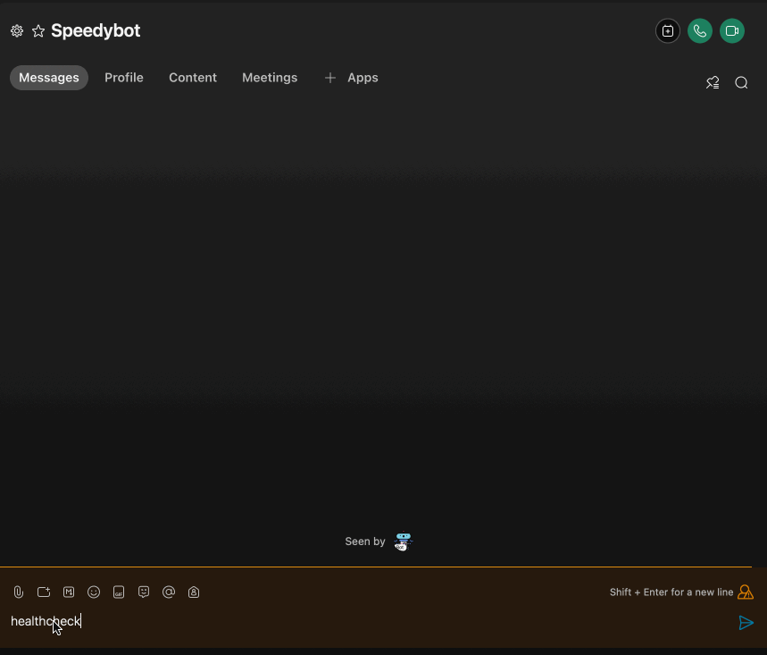

# [QUICKSTART] 🏖 Deploy your bot to Deno

Note: The steps below assume you have a **[working WebEx account](https://developer.webex.com/signup)** & a **[Deno Deploy account](https://deno.com/deploy/)**

## 🎥 Video instructions 🎥

- Video: https://share.descript.com/view/B3mNHNODfZf

## 1) Get the starter bot code

```
git clone https://github.com/valgaze/speedybot-mini
cd speedybot-mini/examples/deno
cat index.ts
```

Or access directly here: **[index.ts](https://github.com/valgaze/speedybot-mini/blob/deploy/examples/deno/index.ts)**

## 2) Set your bot access token

- If you have an existing bot, get its token here: **[https://developer.webex.com/my-apps](https://developer.webex.com/my-apps)**

- If you don't have a bot, create one and save the token from here: **[https://developer.webex.com/my-apps/new/bot](https://developer.webex.com/my-apps/new/bot)**

- Write down your bot's access token, you'll need it in a minute

- Update the `token` field in index.ts with your access token (or securely expose to Deno for a production project)

## 3) Create a new Project in Deno

- If you don't have one, sign up for a **[deno deploy account](https://deno.com/deploy)**

- Press the blue "New Project" button


## 4) Open the Deno "playground"

- Tap the play button in the top right corner


## 5) Copy the contents of index.ts

- Copy/paste the content **[index.ts](./index.ts)** into the Deno playground and update the `token` field if you haven't already

- When ready, press deploy


## 6) Set up your webhooks

- Make a note the URL of the Deno function from the top-right corner

- Use **[speedybot bot-garage 🔧🤖](https://codepen.io/valgaze/full/MWVjEZV)** to set up webhooks that point to your function


## 7) Take it for a spin

- After connecting webhooks, take it for a spin



## Webhook Secret

- Use a webhook secret to secure your agent, **[webhook details here](./../../docs/webhooks.md#webhook-secrets)**

- Register your webhooks using a secret with **[speedybot bot-garage 🔧🤖](https://codepen.io/valgaze/full/MWVjEZV)**

- From the same directory as the repo run the following command to add a secret called `WEBHOOK_SECRET` and use the same secret value used when registering webhooks:

```sh
npx wrangler secret put WEBHOOK_SECRET
```

## Resources

- Deno Deploy docs https://deno.com/deploy/docs

- Deno Playground: https://deno.com/deploy/docs/playgrounds
