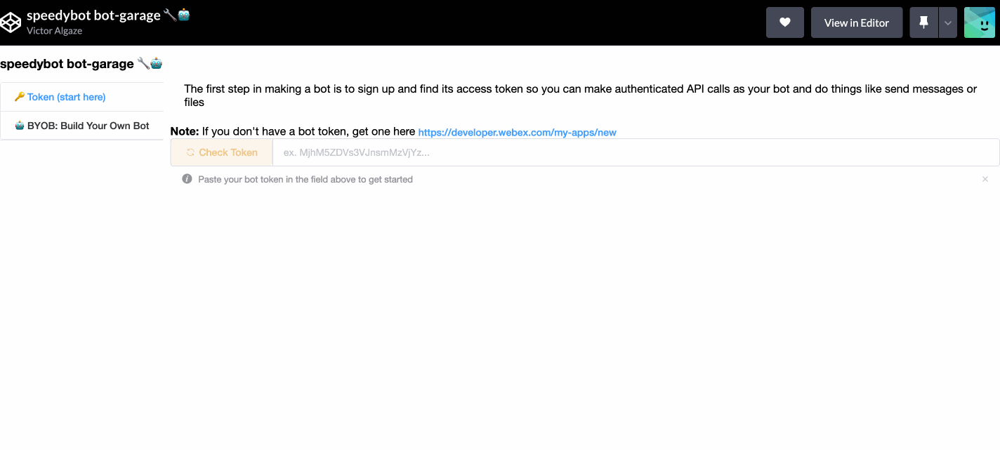

## Webhooks example

Take incoming webhooks + process them. This is running on a "persistent", very server-ful Express server

tl;dr: edit **[./settings/config.ts](./settings/config.ts)** and pass in your token and boot with `npm run start:server`

## Quickstart

Do you want your bot to tell someone (or a group of someones) whenever something happens on an external service like Jira? This is what you need to get up and running fast-- just edit **[./settings/webhooks.ts](./settings/webhooks.ts)** to create a notifer/alert'ing experience using incoming webhooks (ex from a Jira system, support queue, etc)

Note: The steps below assume you have a working WebEx account & **[Nodejs](https://nodejs.org/en/download/)** 12+

## 1. Fetch repo & install dependencies

```
git clone https://github.com/valgaze/speedybot-webhook-sample
cd speedybot-starter
npm i
```

## 2. Set your bot access token

- If you have an existing bot, get its token here: **[https://developer.webex.com/my-apps](https://developer.webex.com/my-apps)**

- If you don't have a bot, create one and save the token from here: **[https://developer.webex.com/my-apps/new/bot](https://developer.webex.com/my-apps/new/bot)**

Once you have the bot's token, save it to **[settings/config.json](./settings/config.json)** under the `token` field

## 3. Boot your "tunnel"

For local dev purposes, you will need to (1) sign up for a (free-tier-eligible) "ngrok" account

Follow the steps here: https://dashboard.ngrok.com/get-started/setup

**WARNING:** nGrok may not be supported by your organization's security posture, as an alternative you can deploy your server to any cloud provider & use its publically-accessible URL for webhooks

```
./ngrok http 8000
```

Note the forwarding URL (you'll need it in a moment), it will look something like this: **https://5a5b-34-567-789-100.ngrok.io**

## 4) Register webhooks

You can use **[speedybot garage 🔧🤖, manage webhooks/secrets/admin](https://codepen.io/valgaze/pen/MWVjEZV)** to register incoming webhooks



## 5) Boot your bot

```
npm start
```

## 6) Take it for a spin

Add your bot from Step 1 in a 1-1 chat session and tell it "hi"-- if everything is configured properly you should see something like this:


## 5. Make a POST request to your bot's incoming webhook

- /incoming_webhook
- / is for chat traffic

Post to `/incoming_webhook` with the following payload

```
{
	"msg": "this would come from a 3rd-party tool reaching your chat-server",
	"id": "5"
}
```

- You can make as many other webhooks as you want and alert people & rooms
