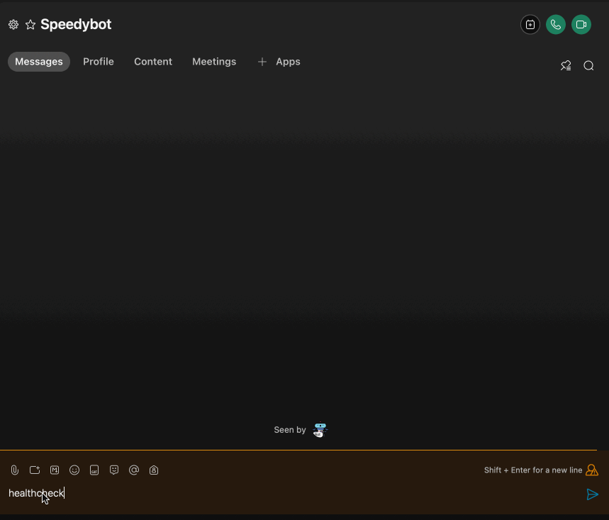

# [QUICKSTART]

This is the fastest way to get up and running (and especially for complex firewall/networking enviroments.)

Turn it on and chat traffic (safely) will be forwarded to your machine using websockets. Websockets are powered by the **[WebEx JS SDK](https://github.com/webex/webex-js-sdk)** This websocket approach can be useful thorny firewall situations.

Note: The steps below assume you have a working WebEx account & **[Nodejs](https://nodejs.org/en/download/)** 16.7+

## 1) Fetch repo & install deps

```
git clone https://github.com/valgaze/speedybot-mini
cd speedybot-mini/examples/websockets
npm i
```

## 2) Set your bot access token

- If you have an existing bot, get its token here: **[https://developer.webex.com/my-apps](https://developer.webex.com/my-apps)**

- If you don't have a bot, create one and save the token from here: **[https://developer.webex.com/my-apps/new/bot](https://developer.webex.com/my-apps/new/bot)**

- Copy the file **[.env.example](.env.example)** as `.env` in the root of your project and save your access token under the `BOT_TOKEN` field.

## 3) Turn it on!

```
npm start
```



## 4) Build your agent

- The only file you need to think about is **[settings/config.ts](./settings/config.ts)**

- **[📚 API Docs](https://github.com/valgaze/speedybot-mini/blob/deploy/api-docs/modules.md#classes)**

## Boot

- `npm run dev`: Boot with reload on code changes
- `npm run reset`: If you encounter an issue with "too may device registrations" when using live-reload run this command-- wait a few minutes after running before reattempting websockets

## Resources

- https://www.npmjs.com/package/webex
- https://developer.webex.com/blog/using-websockets-with-the-webex-javascript-sdk
