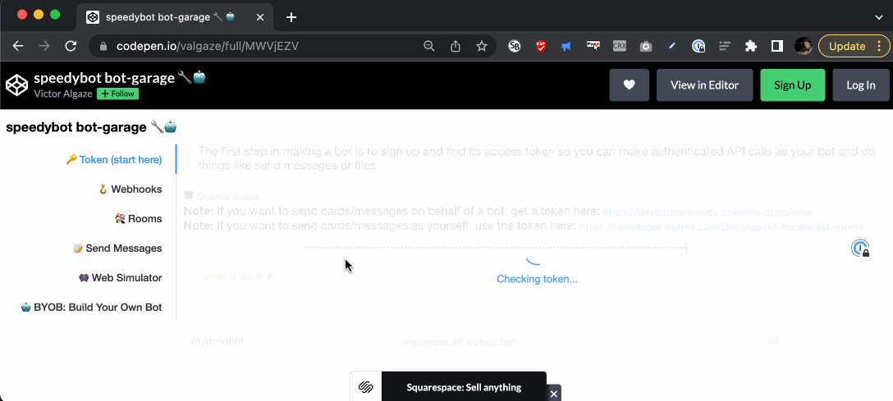

# [QUICKSTART]

Note: The steps below assume you have a working WebEx account & **[Nodejs](https://nodejs.org/en/download/)** 16.7+

## 1) Fetch repo & install deps

```
git clone https://github.com/valgaze/speedybot-mini
cd speedybot-mini/examples/deno
npm i
```

## 2) Set your bot access token

- If you have an existing bot, get its token here: **[https://developer.webex.com/my-apps](https://developer.webex.com/my-apps)**

- If you don't have a bot, create one and save the token from here: **[https://developer.webex.com/my-apps/new/bot](https://developer.webex.com/my-apps/new/bot)**

- Write down your bot's access token, you'll need it in a minute

## 3) Get your bot URL

- If you don't have one already, get a **[cloudflare account](https://dash.cloudflare.com/sign-up)**

- Authenticate your machine with `npx wrangler login`

- Create a new "worker" from the **[cloudflare dashboard](https://dash.cloudflare.com)** & note its URL (you can name it something like https://speedybot1234.username.workers.dev)

## 4) Add your bot token

From the same directory as the repo run the following command to add a secret called `BOT_TOKEN` and enter your info using **[secrets manager](https://blog.cloudflare.com/workers-secrets-environment/#supporting-secrets)**

```sh
npx wrangler secret put BOT_TOKEN
```


## 5) Deploy your agent

From the same directory as the repo run this command to deploy your agent (now bound with your `BOT_TOKEN` secret)

```
npm run deploy
```

## 6) Register your webhooks

- Make a note the URL of the deployed function (ie http://speedybot-mini.username.workers.dev)

- Use **[speedybot bot-garage 🔧🤖](https://codepen.io/valgaze/full/MWVjEZV)** to set up webhooks that point to your function



## 7) Take it for a spin

- After connecting webhooks, take it for a spin


## Webhook Secret

- Use a webhook secret to secure your agent, **[webhook details here](./../../docs/webhooks.md#webhook-secrets)**

- Register your webhooks using a secret with **[speedybot bot-garage 🔧🤖](https://codepen.io/valgaze/full/MWVjEZV)**

- From the same directory as the repo run the following command to add a secret called `WEBHOOK_SECRET` and use the same secret value used when registering webhooks:

```sh
npx wrangler secret put WEBHOOK_SECRET
```
